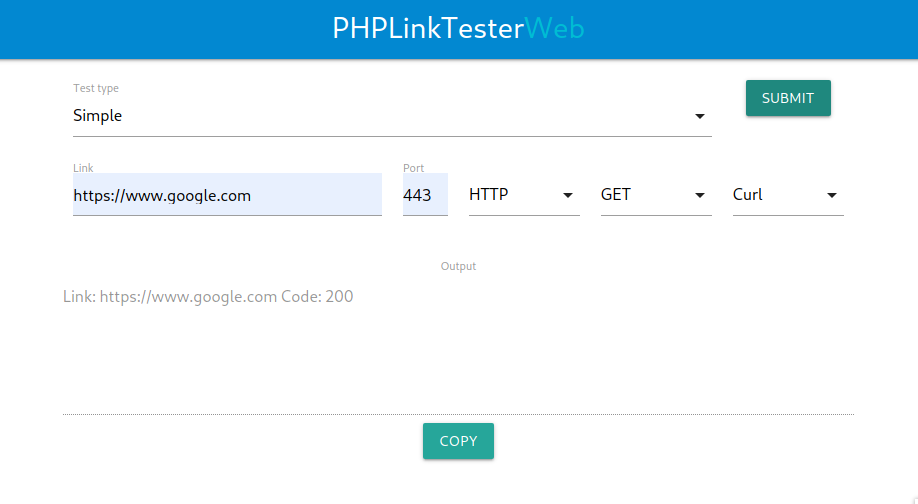

# PHPLinkTester

Front view for the PHPLinkTesterWeb.
#### PHP Link Tester is a project for testing HTTP connections and protocols like SSH, IMAP, POP3 and other protocols.

## Architecture
Project based on clean architecture, which can be used both in CLI and Web. Both forms of use reuse the same architecture.

* `PHPLinkTester/`: Architecture's main directory, both `PHPLinkTesterWeb/` and `PHPLinktesterCli/`: use it.

* `PHPLinkTesterWeb/`: Web application using Lumen, Materialize and Javascript. It is possible to make a simple web request for a single link, as well as multiple requests for several different links with different protocols.

* `PHPLinkTesterCLI/`: CLI Script with the same purpose, accepting multiple arguments.

## Usage
The parameters needed for use are: **Link, Port, Method and interface**.

For the interface, it is possible to use CURL or Guzzle in HTTP requests and only FSOCK for protocol requests.

The return will be the HTTP code in cases of requests of the same type, or 1/0 for requests of the protocol type, being 1 for a successful connection.

## Running 
* Run `./configure.sh` to install composer dependencies and autoload.
* `PHPLinkTesterWeb/`: Is possible to test running something like: `php -S PHPLinkTesterWeb/public/ -t localhost:8181` and access **localhost:8181** to see the web interface.
* `PHPLinkTesterCLI/`: Run `php PHPLinkTesterCLI/PHPLinkTester.php -h` to see te availible options.